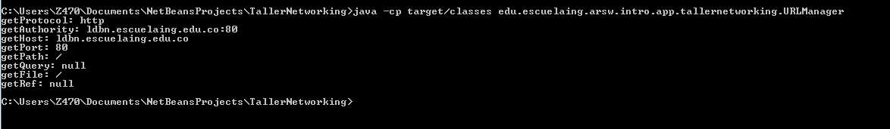
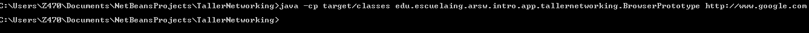
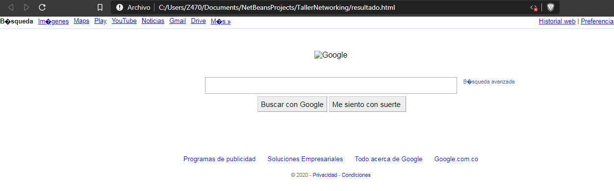
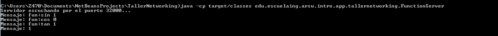
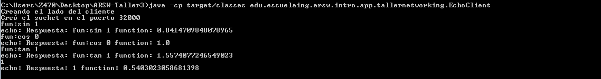
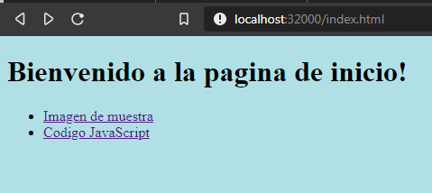
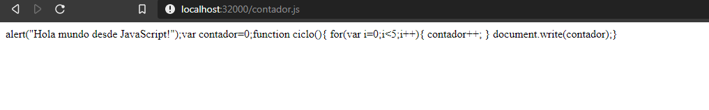
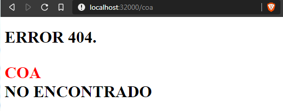
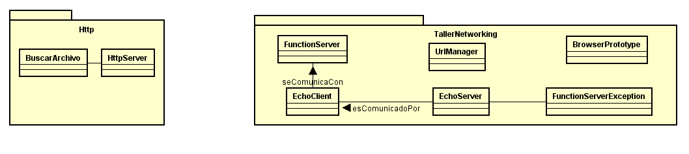

# Introducción a redes, clientes y servicios con Java

El siguiente repositorio contiene varios ejercicios en los cuales se vera una introducción a temas relacionados con manejo de URL's, Sockets por parte de un servidor y un cliente.

## Instrucciones de uso

Para poder usar el proyecto lo primero que debe realizar es clonar este repositorio utilizando el siguiente comando desde la terminal del S.O que este utilizando:

```
git clone https://github.com/EdKillah/ARSW-Taller3
```
Otra alternativa es descargarlo directamente por formato ZIP en el botón que indica **"Clone or Download".**
Luego debe redirigirse por medio de la terminal al directorio raíz la cual contiene el achivo pom.xml.

Una vez se encuentre en este directorio se debe compilar el programa para esto se debe ejecutar el siguiente comando:

```
mvn package
```

Una vez compliado el repositorio completo se encuentra en posibilidad de probar los siguientes ejercicios:

### EJERCICIO 1

 Escriba un programa en el cual usted cree un objeto URL e imprima en pantalla cada uno de los datos que retornan los siguientes métodos: 
"getProtocol", "getAuthority", "getHost", "getPort", "getPath", "getQuery", "getFile", "getRef"

#### Comando para ejecutar:
```
java -cp target/miprimera-app-1.0-SNAPSHOT.jar edu.escuelaing.arsw.intro.app.tallernetworking.URLManager
```

#### Código del programa:

```
package edu.escuelaing.arsw.intro.app.tallernetworking;

import java.io.*;
import java.net.*;

/**
 * Clase que permite una conexion con un socketServer para generar una comunicacion cliente servidior.
 * @author Eduard Jimenez
 */

public class EchoClient {

    public static void main(String[] args) throws IOException {

        Socket echoSocket = null;
        PrintWriter out = null;
        BufferedReader in = null;
        System.out.println("Creando el lado del cliente");
        try {
            echoSocket = new Socket("127.0.0.1", 32000);
            System.out.println("Creó el socket en el puerto 32000");
            out = new PrintWriter(echoSocket.getOutputStream(), true);
            in = new BufferedReader(new InputStreamReader(
                    echoSocket.getInputStream()));
        } catch (UnknownHostException e) {
            System.err.println("Don't know about host!.");
            System.exit(1);
        } catch (IOException e) {
            System.err.println("Couldn't get I/O for "
                    + "the connection to: localhost.");
            System.exit(1);
        }

        BufferedReader stdIn = new BufferedReader(
                new InputStreamReader(System.in));
        String userInput;

        while ((userInput = stdIn.readLine()) != null) {
            out.println(userInput);
            System.out.println("echo: " + in.readLine());
        }
        out.close();
        in.close();
        stdIn.close();
        echoSocket.close();
    }
}

```



### EJERCICIO 2

Escriba una aplicación browser que pregunte una dirección URL al usuario y que lea datos de esa dirección y que los almacene en un archivo con el nombre resultado.html. Luego intente ver este archivo en el navegador.

#### Comando para ejecutar:
```
java -cp target/miprimera-app-1.0-SNAPSHOT.jar edu.escuelaing.arsw.intro.app.tallernetworking.BrowserPrototype
```

#### Código del programa:

```
package edu.escuelaing.arsw.intro.app.tallernetworking;

import java.io.*;
import java.net.*;

/**
 * Clase que me permite acceder a una pagina web y me guarda la informacion en un archivo html
 * @author Eduard Jimenez
 */
public class BrowserPrototype {

    public static void main(String[] args) throws Exception {
        String urlUser = args[0];
        URL url = new URL(urlUser);
        FileWriter archivo = new FileWriter("resultado.html");
        try (BufferedReader reader
                = new BufferedReader(new InputStreamReader(url.openStream()))) {
            String inputLine = null;
            while ((inputLine = reader.readLine()) != null) {
                archivo.write(inputLine);
            }
            archivo.close();
        } catch (IOException x) {
            System.err.println(x);
        }
    }

}

```



### EJERCICIO 4.3.1

Escriba un servidor que reciba un número y responda el cuadrado de este número.

Para ejecutar este ejercicio se requiere abrir dos consolas/terminales en las cuales se ejecutará el Socket del servidor  y el Socket del cliente. ***Primero se debe ejecutar el Socket del servidor para que no genere errores.***

#### Comando para ejecutar ServerSocket:
```
java -cp target/miprimera-app-1.0-SNAPSHOT.jar edu.escuelaing.arsw.intro.app.tallernetworking.EchoServer
```

#### Comando para ejecutar ClientSocket:
```
java -cp target/miprimera-app-1.0-SNAPSHOT.jar edu.escuelaing.arsw.intro.app.tallernetworking.EchoClient
```

#### Código del programa ServerSocket (EchoServer):

```
package edu.escuelaing.arsw.intro.app.tallernetworking;

/**
 *
 * @author Eduard Jimenez
 */
import java.net.*;
import java.io.*;

public class EchoServer {

    public static void main(String[] args) throws IOException {
        ServerSocket serverSocket = null;
        
        try {
            serverSocket = new ServerSocket(32000);
           
        } catch (IOException e) {
            System.err.println("Could not listen on port: 32000.");
            System.exit(1);
        }
        Socket clientSocket = null;
        try {
            clientSocket = serverSocket.accept();
            System.out.println("Servidor escuchando por el puerto 32000...");
        } catch (IOException e) {
            System.err.println("Accept failed.");
            System.exit(1);
        }
        PrintWriter out = new PrintWriter(clientSocket.getOutputStream(), true);
        BufferedReader in = new BufferedReader(
                new InputStreamReader(
                        clientSocket.getInputStream()));
        String inputLine, outputLine;
        while ((inputLine = in.readLine()) != null) {
            System.out.println(
                    "Mensaje: " + inputLine
            );
            try{
                Double numero = Double.parseDouble(inputLine);
                numero = Math.pow(numero, 2);    
                outputLine = "Respuesta: " + inputLine +" numero: "+numero;
            }catch(NumberFormatException e){
                outputLine = "Respuesta: Entrada no valida. Error: " +e;
            }
            out.println(outputLine);
            if (outputLine.equals("Respuesta: Bye.")) {
                break;
            }
        }
        out.close();
        in.close();
        clientSocket.close();
        serverSocket.close();
    }
    
}

```

#### Código del programa ServerSocket (EchoClient):

```
package edu.escuelaing.arsw.intro.app.tallernetworking;

import java.io.*;
import java.net.*;

/**
 * Clase que permite una conexion con un socketServer para generar una comunicacion cliente servidior.
 * @author Eduard Jimenez
 */

public class EchoClient {

    public static void main(String[] args) throws IOException {

        Socket echoSocket = null;
        PrintWriter out = null;
        BufferedReader in = null;
        System.out.println("Creando el lado del cliente");
        try {
            echoSocket = new Socket("127.0.0.1", 32000);
            System.out.println("Creó el socket en el puerto 32000");
            out = new PrintWriter(echoSocket.getOutputStream(), true);
            in = new BufferedReader(new InputStreamReader(
                    echoSocket.getInputStream()));
        } catch (UnknownHostException e) {
            System.err.println("Don't know about host!.");
            System.exit(1);
        } catch (IOException e) {
            System.err.println("Couldn't get I/O for "
                    + "the connection to: localhost.");
            System.exit(1);
        }

        BufferedReader stdIn = new BufferedReader(
                new InputStreamReader(System.in));
        String userInput;

        while ((userInput = stdIn.readLine()) != null) {
            out.println(userInput);
            System.out.println("echo: " + in.readLine());
        }
        out.close();
        in.close();
        stdIn.close();
        echoSocket.close();
    }
}

```
#### Pagina descargada y almacenada en el archivo resultado.html




### EJERCICIO 4.3.2

Escriba un servidor que pueda recibir un número y responda con un operación sobre este número. Este servidor puede recibir un mensaje que empiece por “fun:”, si recibe este mensaje cambia la operación a las especificada. El servidor debe responder las funciones seno, coseno y tangente. Por defecto debe empezar calculando el coseno. Por ejemplo, si el primer número que recibe es 0, debe responder 1, si después recibe π/2 debe responder 0, si luego recibe “fun:sin” debe cambiar la operación actual a seno, es decir a a partir de ese momento debe calcular senos. Si enseguida recibe 0 debe responder 0.

En este ejercicio también se requieren de dos terminales/consolas para ejecutar correctamente el programa y como en el caso anterior se debe ejecutar inicilamente el SocketServer (FunctionServer) seguido del SocketClient.

#### Comando para ejecutar FunctionServer:
```
java -cp target/miprimera-app-1.0-SNAPSHOT.jar edu.escuelaing.arsw.intro.app.tallernetworking.FunctionServer
```
#### Comando para ejecutar EchoClient:
```
java -cp target/miprimera-app-1.0-SNAPSHOT.jar edu.escuelaing.arsw.intro.app.tallernetworking.EchoClient fun:value number
```
**value:  contiene los siguientes valores validos**

 - fun:sin
 - fun:cos
- fun:tang

El valor por defecto es fun:cos por lo que se puede omitir su llamado y colocar directamente el ***number***

**number: un número cualquiera al que se le quiere aplicar la función indicada**

#### Código del programa FunctionSocket:

```
package edu.escuelaing.arsw.intro.app.tallernetworking;

/**
 *
 * @author Eduard Jimenez
 */
import java.net.*;
import java.io.*;

public class FunctionServer {

    public static void main(String[] args) throws IOException {
        ServerSocket serverSocket = null;
        try {
            serverSocket = new ServerSocket(32000);
        } catch (IOException e) {
            System.err.println("Could not listen on port: 32000.");
            System.exit(1);
        }
        Socket clientSocket = null;
        try {
            clientSocket = serverSocket.accept();
            System.out.println("Servidor escuchando por el puerto 32000...");
        } catch (IOException e) {
            System.err.println("Accept failed.");
            System.exit(1);
        }
        PrintWriter out = new PrintWriter(clientSocket.getOutputStream(), true);
        BufferedReader in = new BufferedReader(
                new InputStreamReader(
                        clientSocket.getInputStream()));
        String inputLine, outputLine;
        while ((inputLine = in.readLine()) != null) {
            System.out.println(
                    "Mensaje: " + inputLine
            );
            try {

                Double number = validateInput(inputLine);
                outputLine = "Respuesta: " + inputLine + " function: " + number;
            } catch (NumberFormatException | FunctionServerException e) {
                outputLine = "Respuesta: Entrada no valida. Error: " + e;
            }
            out.println(outputLine);
            if (outputLine.equals("Respuesta: Bye.")) {
                break;
            }
        }
        out.close();
        in.close();
        clientSocket.close();
        serverSocket.close();
    }

    private static Double validateInput(String inputLine) throws FunctionServerException {
        String[] nuevo = inputLine.split(" ");
        String function = "fun:cos";
        Double number;

        if (nuevo.length > 1) {
            function = nuevo[0];
            number = Double.parseDouble(nuevo[1]);
        } else {
            number = Double.parseDouble(nuevo[0]);
        }
        return validateFunction(function, number);

    }

    private static Double validateFunction(String function, Double number) throws FunctionServerException {

        Double res;
        if (function.equals("fun:sin")) {
            res = Math.sin(number);
        } else if (function.equals("fun:tan")) {
            res = Math.tan(number);
        } else if(function.equals("fun:cos")) {
            res = Math.cos(number);
        }else{
            System.out.println("Entra en else");
            throw new FunctionServerException(FunctionServerException.MAL_FORMED_FUNCTION);
            
        }
        return res;
    }

}

```

#### Código del programa ServerSocket (EchoClient):

```
package edu.escuelaing.arsw.intro.app.tallernetworking;

import java.io.*;
import java.net.*;

/**
 * Clase que permite una conexion con un socketServer para generar una comunicacion cliente servidior.
 * @author Eduard Jimenez
 */

public class EchoClient {

    public static void main(String[] args) throws IOException {

        Socket echoSocket = null;
        PrintWriter out = null;
        BufferedReader in = null;
        System.out.println("Creando el lado del cliente");
        try {
            echoSocket = new Socket("127.0.0.1", 32000);
            System.out.println("Creó el socket en el puerto 32000");
            out = new PrintWriter(echoSocket.getOutputStream(), true);
            in = new BufferedReader(new InputStreamReader(
                    echoSocket.getInputStream()));
        } catch (UnknownHostException e) {
            System.err.println("Don't know about host!.");
            System.exit(1);
        } catch (IOException e) {
            System.err.println("Couldn't get I/O for "
                    + "the connection to: localhost.");
            System.exit(1);
        }

        BufferedReader stdIn = new BufferedReader(
                new InputStreamReader(System.in));
        String userInput;

        while ((userInput = stdIn.readLine()) != null) {
            out.println(userInput);
            System.out.println("echo: " + in.readLine());
        }
        out.close();
        in.close();
        stdIn.close();
        echoSocket.close();
    }
}

```
#### Ejecución del servidor


#### Ejecución del cliente




### EJERCICIO 4.5.1

Escriba un servidor web que soporte múltiples solicitudes seguidas (no concurrentes). El servidor debe retornar todos los archivos solicitados, incluyendo páginas html e imágenes.

#### Comando para ejecutar Http:
```
java -cp target/miprimera-app-1.0-SNAPSHOT.jar edu.escuelaing.arsw.intro.app.tallernetworking.Http.HttpServer
```

#### Código del programa ServerSocket (EchoClient):

```
package edu.escuelaing.arsw.intro.app.tallernetworking.Http;

/**
 *
 * @author Eduard Jimenez.
 */
import java.awt.image.BufferedImage;
import java.net.*;
import java.io.*;
import javax.imageio.ImageIO;

public class HttpServer {

    public static void main(String[] args) throws IOException {
        ServerSocket serverSocket = null;

        try {
            serverSocket = new ServerSocket(32000);
        } catch (IOException e) {
            System.err.println("Could not listen on port: 32000.");
            System.exit(1);
        }
        Socket clientSocket = null;
        while (true) {
            try {
                System.out.println("Listo para recibir ...");
                clientSocket = serverSocket.accept();
            } catch (IOException e) {
                System.err.println("Accept failed.");
                System.exit(1);
            }
            PrintWriter out;
            BufferedReader in;

            out = new PrintWriter(clientSocket.getOutputStream(), true);
            in = new BufferedReader(
                    new InputStreamReader(
                            clientSocket.getInputStream()));
            String inputLine, outputLine, res = "";
            int contador = 0;
            while ((inputLine = in.readLine()) != null) {
                System.out.println("Received: " + inputLine);
                if (contador == 0) {
                    res = inputLine;
                }

                contador++;
                if (!in.ready()) {
                    break;
                }
            }
            outputLine = "";
            if (res.substring(0, 3).equals("GET")) {
                BuscarArchivo find = new BuscarArchivo();
                File archivoEncontrado = find.buscador(
                        res.substring(5, res.length() - 9),
                        new File("C:\\Users\\Z470\\Documents\\NetBeansProjects\\TallerNetworking\\src\\main"));
                if (archivoEncontrado != null) {

                    BufferedReader reader = new BufferedReader(new FileReader(archivoEncontrado));
                    StringBuilder cadena = new StringBuilder();
                    String line = null;
                    while ((line = reader.readLine()) != null) {
                        cadena.append(line);
                    }
                    
                    BufferedImage image = ImageIO.read(new File("C:\\Users\\Z470\\Documents\\NetBeansProjects\\TallerNetworking\\src\\main\\resources\\img\\suzaku.png"));
                    
                    out.println("HTTP/1.1 200 OK");
                    
                    if(res.substring(res.length() - 12,  res.length() - 9).toUpperCase().equals("PNG")){
                        out.println("Content-Type: image/png");
                        out.println(); 
                        ImageIO.write(image, "PNG", clientSocket.getOutputStream());
                        
                    }else{
                        out.println("Content-Type: text/html");
                        out.println(); 
                        out.println(cadena);
                    }

                    

                } else {
                    outputLine = error(outputLine,res);
                    out.println(outputLine);
                }
            }

            out.close();
            in.close();
        }

    }

    private static String error(String outputLine, String res) {
       
        outputLine = "HTTP/1.1 200 OK\r\n"
                + "Content-Type: text/html\r\n"
                + "\r\n"
                + "<!DOCTYPE html>"
                + "<html>"
                + "<head>"
                + "<meta charset=\"UTF-8\">"
                + "<title>Title of the document</title>\n"
                + "</head>"
                + "<body>"
                + "<h1>ERROR 404.<p><div style='color:red'>" + res.substring(5, res.length() - 9).toUpperCase() + "</div>" + " NO ENCONTRADO</p></h1>"
                + "</body>"
                + "</html>";
        return outputLine;
    }
}

```

#### Código del programa BuscadorArchivos:
```

package edu.escuelaing.arsw.intro.app.tallernetworking.Http;


import java.io.*;
/**
 * Clase que busca un archivo en especifico dada una ruta raiz.
 *
 * @author (Eduard Jimenez)
 * @version 1.0
 */
public class BuscarArchivo
{
   File archivoEncontrado = null;
   
   public BuscarArchivo() { }
   
   /**
    * Metodo que retorna el File del archivo si este se encuentra E.O.C retornara null.
    * @param nombre El nombre del archivo que se esta buscando
    * @param raiz La ruta raiz donde comienza a buscar el archivo
    * @return archivoEncontrado El File del archivo
    */
   public File buscador(String nombre, File raiz){
       
       File[] lista = raiz.listFiles();
       if(lista != null) {
           for(File elemento : lista) {
               if (elemento.isDirectory())  {
                   buscador(nombre, elemento);
                } else if (nombre.equalsIgnoreCase(elemento.getName()))
                  { archivoEncontrado = elemento; System.out.println("El Archivo ha sido encontrado.");}
                }
            }
             return archivoEncontrado;
        } 
}
```
#### Acceso a imagen


#### Acceso a html



#### Acceso a imagen




#### Página de error sencilla



### Prerequisitos

Para ejecutar con éxito este programa se requiere de los siguientes programas instalados en su máquina:

```
java version: "1.8.0_171"
git version: 2.19.1.windows.1
Apache Maven version: 3.6.3
```

## Diagrama de clases

La siguiente imagen muestra los diagramas de clases contenidos en sus respectivos paquetes en los cuales se encuentran las clases de ClienteSocket (EchoClient) y el ServerSocket (FunctionSocket | EchoServer). Además se incluyen las clases de URLManager que utiliza las propiedades de una clase URL en java y BrowserPrototype la cual guarda una página web y la almacena en un archivo html.




## Construido con


* [Maven](https://maven.apache.org/) - Dependency Management
* [Java](https://www.java.com/es/download/) - Lenguaje de programación
* [Git](https://github.com/) - Versionamiento


## Authors

* **Eduard Jimenez** - *LOCS/Hora  660/15 = 44 LOCS/Hora* - Fecha: 10/06/2020


## Licencia

This project is licensed under the MIT License - see the [LICENSE.md](LICENSE.md) file for details


### Enlace al sistema de integración continua

_A continuación se presenta el link:_
